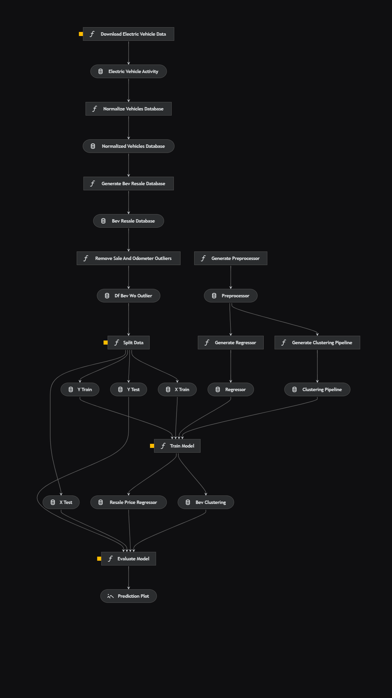

# Electric Vehicles


[](https://github.com/daniel64bit/biofuel_brazil_plants/blob/main/LICENSE.md)

## Visão Geral

Os dados utilizados nesse projetos são fornecidos pelo Estado de Wahsington (EUA), por meio de seu portal de dados abertos, [Data.WA.gov](https://data.wa.gov/), com informações de diferentes setores, como educação, transporte e finanças.

A base de dados escolhida diz respeito a mudanças de titularidade (compra e venda) de carros elétricos em Washington, disponíveis em: [Electric Vehicle Title and Registration Activity
](https://data.wa.gov/Transportation/Electric-Vehicle-Title-and-Registration-Activity/rpr4-cgyd).

Esse projeto foi gerado utilizando o framework [Kedro](https://docs.kedro.org/en/stable/).

### Descritivo dos dados


## Objetivos e metas
- Análise Exploratória:
  - Tipos de veículos mais vendidos
  - Autonomia de bateria
  - Preço de revenda
  - Localidades com maior rotatividade
  - Datas com vendas mais intensas
- Modelo preditivo:
  - Previsão de preço de revenda de veículos puramente elétricos
- Storytelling:
  - Organização de apresentação simples e objetiva para apresentação de resultados

## Fluxograma do projeto



## Regras

- Não remova nenhuma linha do arquivo `.gitignore`
- Certifique-se de que seus resultados possam ser reproduzidos
- Não comite dados ao repositório
- Não comite credenciais ou configurações locais ao repositório. Mantenha todas as suas credenciais e configurações locais em `conf/local/`

## Requisitos

As bibliotecas necessárias para a execução do projeto estão listadas no arquivo `src/requirements.txt`. Para instalá-las, utilize o comando:

```
pip install -r src/requirements.txt
```

## Como executar o pipeline

Para executar o projeto, utilize o comando:

```
kedro run
```

Para executar uma pipeline específica, utilize o comando:
```
kedro run --pipeline <nome-da-pipeline>
```

## Autores

- [Daniel Rodrigues](https://www.linkedin.com/in/danielrod147/)
- [João Arthur](https://www.linkedin.com/in/jarthurcs25/)
- [Gabriel Sicari](https://www.linkedin.com/in/gabrielsicari/)
